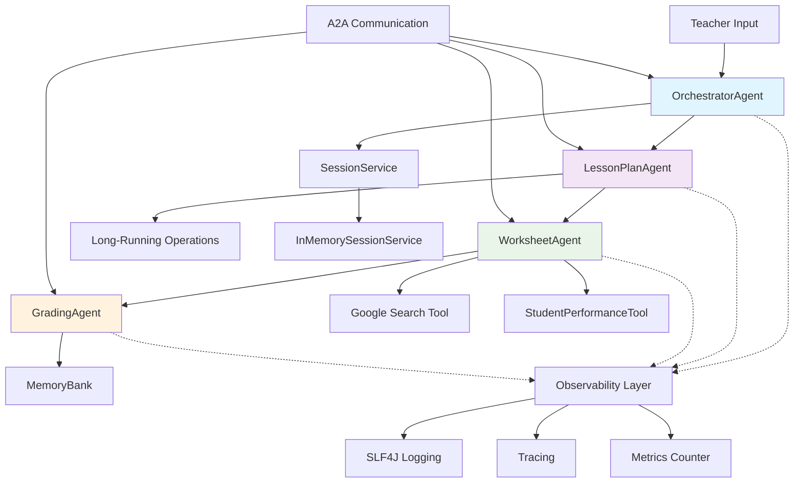

# Classroom Assistant Architecture

## Agent Flow
1. **OrchestratorAgent** receives teacher request
2. **LessonPlanAgent** generates structured lesson plans (with long-running ops)
3. **WorksheetAgent** creates worksheets using tools (Google Search, StudentPerformanceTool)
4. **GradingAgent** processes student responses and stores in memory
5. Loop back for multiple worksheets if requested

## Tools Integration
- **StudentPerformanceTool**: Custom MCP tool for statistics
- **Google Search**: Built-in tool for content research
- **Code Execution**: JavaProcessTool for calculations

## Memory & Sessions
- **SessionService**: Maintains conversation context
- **MemoryBank**: Long-term storage for student progress
- **Context Compaction**: Automatic memory optimization